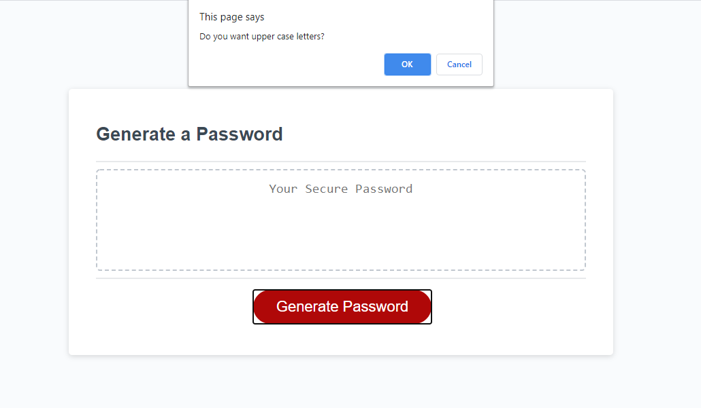

# Password Generator Starter Code Used

## Project title: Password Generator

## Description: This is a site that will generate a password when the button is clicked.

## Table of Contents
* [Instillation](#installation)
* [Usage](#usage)
* [Credits](#credits)
* [License](#license)

## Installation:

There are no steps to install. Please navigate to the deployed site using the link below.

# Usage: 

Navigate to the deployed page to view the site. When on the site click the button to generate a password. Below is a snapshot of the site.

## License: 

None. 

## Credits: 

Katherine Lynn with starter code used from Xandromus

## Github deployed page: 

[Github deployed page](https://klynn726.github.io/password-generator/)

## Github repository: 

[Github repository](https://github.com/klynn726/password-generator)
